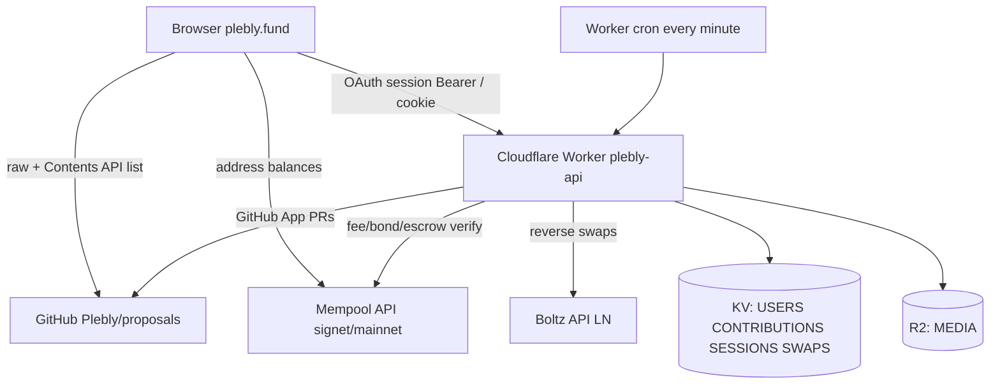

# Plebly — system as implemented

**Status:** living description of the running system (not a wishlist).  
**Date:** 2026-07-27  
**Network (deployed):** Bitcoin **signet**  
**Escrow mode (live):** `single-key-test` (`/health.escrow_mode`)  
**API:** https://plebly-api.securesovereigns.workers.dev (Workers `main` @ `a50b4c8`)  
**Site:** https://plebly.fund (SPA `main` @ `e9c6168`)  
**Proposals `main` tip:** Sparrow signet escrows landed ([PR #6](https://github.com/Plebly/proposals/pull/6)); soft-launch protocol pack open as [PR #7](https://github.com/Plebly/proposals/pull/7)

Related docs: [`remaining-human-steps.md`](remaining-human-steps.md) (ops checklist — human-only leftovers), [`post-mvp-roadmap.md`](post-mvp-roadmap.md) (after-MVP engineering plan), `PARAMETERS.md` / `KEYHOLDERS.md` / `TESTING.md` / `REVIEWERS.md` in [Plebly/proposals](https://github.com/Plebly/proposals); design history in this folder (`open-questions-resolved.md`, `implementation-plan.md`, `plebly-technical-infrastructure-v4.md`).

---

## 1. Purpose and trust model

Plebly is a **public funding surface for Bitcoin work**: proposals live in git, sats sit at **on-chain escrow addresses**, builders claim exclusivity with a bond, and reviewers / keyholders execute outcomes under published rules.

**What the platform does**

- Host the site and Workers API (auth, claims, fees, Lightning claimer, ballots).
- Open GitHub PRs into `Plebly/proposals` (GitHub App).
- Verify fees/bonds and escrow balances via public mempool APIs.
- Index contributions and enforce claim-abuse / funding-window rules in KV + cron.

**What the platform does not do**

- Hold production multisig keys or auto-spend escrow (Workers never sign releases).
- Replace git as the canonical proposal record.
- Confiscate unclaimed refunds or take a fee on refunds (Q17).

**Residual trust (v1):** 3-of-5 keyholders can stall after reviewer approval; there is no on-chain timelock. Ops runbook + site stall banner (`/escrow/stall`). Documented in PARAMETERS (Q21).

---

## 2. Repository layout

Three git repos (no monorepo):

| Path | Repo | Role |
|------|------|------|
| `workers/` | [Plebly/workers](https://github.com/Plebly/workers) | Cloudflare Worker API + cron |
| `plebly.fund/` | [Plebly/plebly.fund](https://github.com/Plebly/plebly.fund) | Static SPA (Vite → GitHub Pages) |
| `proposals/` | [Plebly/proposals](https://github.com/Plebly/proposals) | Canonical proposals, schema, CI, parameters |
| `docs/` | *(local / not a git root)* | Design + this document |

Proposal markdown lives under `proposals/proposals/{unindexed,listed,claimed,completed,declined}/`.

---

## 3. High-level architecture



**Data authority**

| Concern | Source of truth |
|---------|-----------------|
| Proposal text + status | Git on `main` in `Plebly/proposals` |
| Balances / fee txs | Bitcoin chain via mempool.space |
| Sessions, ledgers, pending claims, ballots | Worker KV |
| Covers | R2 |

---

## 4. Runtime configuration (deployed)

### Workers (`workers/wrangler.toml`)

| Binding / var | Value / meaning |
|---------------|-----------------|
| `BITCOIN_NETWORK` | `signet` |
| `MEMPOOL_API` | `https://mempool.space/signet/api` |
| `PROPOSALS_REPO` | `Plebly/proposals` |
| `FRONTEND_ORIGIN` | `https://plebly.fund` |
| `TEST_ESCROW_ADDRESS` | Live: `tb1qhj27cegpek02g8g4peps0x7gqs0svvs888svyz` (operator Sparrow; **only** in single-key-test; must be absent in multisig) |
| `TEST_SUBMISSION_FEE_ADDRESS` | Live: **same** as smoke escrow receive (ops debt — split when ready) |
| KV | `USERS`, `CONTRIBUTIONS`, `SESSIONS`, `SWAPS`, `VIEWS` |
| R2 | `MEDIA` → `plebly-media` |
| Cron | `* * * * *` |

**Secrets / vars (not all in git):** `SESSION_SECRET`, `HOOK_SECRET`, GitHub OAuth + App, `X_CLIENT_ID` / `X_CLIENT_SECRET`, `ANTHROPIC_API_KEY`, `AI_REVIEW_MODEL`, `AI_REVIEW_PROMPT_VERSION`, `BOOTSTRAP_REVIEWERS`, `ALLOW_FORCE_OUTCOME` (mainnet force escape), mainnet `SUBMISSION_FEE_ADDRESS` / `ESCROW_DESCRIPTOR` / `ESCROW_ADDRESS_MAP`.

### Escrow mode boundary (hard fail)

Resolved by `workers/src/lib/escrow-mode.ts` from env — **not** from `BITCOIN_NETWORK` alone:

| Mode | Required env | Forbidden env |
|------|--------------|---------------|
| `single-key-test` | `TEST_ESCROW_ADDRESS` | `ESCROW_DESCRIPTOR`, `ESCROW_ADDRESS_MAP`; also forbidden when `BITCOIN_NETWORK=mainnet` |
| `multisig` | `ESCROW_DESCRIPTOR` **and** `ESCROW_ADDRESS_MAP` (non-empty JSON index→address) | `TEST_ESCROW_ADDRESS` |
| *(misconfigured)* | any other combination | — |

Misconfiguration: Worker **refuses all non-`/health` requests** with HTTP 503 + `code: escrow_misconfigured` and logs the missing/conflicting vars. Cron skips work. `/health` returns `ok: false` (503) with the same mode fields so monitoring needs no mode-specific logic.

`/health` always includes: `escrow_mode`, `escrow_descriptor_set`, `escrow_test_address_set`, `escrow_map_size`, `escrow_next_index`, `escrow_map_remaining`, `escrow_map_exhausted`, `escrow_config_error`.

### Frontend (`plebly.fund/src/config.ts` + Pages CI)

- `VITE_WORKERS_API` → Workers URL above  
- `VITE_BITCOIN_NETWORK=signet`  
- Proposals loaded from GitHub raw + Contents API  

---

## 5. Authentication and authorization

### End-user session

1. **GitHub OAuth** (`GET /auth/github` → callback) creates session user `github:{id}`.
2. **X OAuth 2.0 + PKCE** (`GET /auth/x` → `/auth/x/callback`) creates session user `x:{id}` (confidential client; Basic auth on token exchange). Requires `X_CLIENT_ID` / `X_CLIENT_SECRET`; 501 if unset.
3. **Nostr** (`/auth/nostr/challenge` + `POST /auth/nostr`) creates `nostr:{pubkey}`.
4. Session is a **JWT** (HS256, 7d) signed with `SESSION_SECRET` (`lib/session.ts`).
5. Delivered as `HttpOnly` cookie and/or `Authorization: Bearer` (hash handoff `#plebly_auth=` for cross-origin).
6. Profile stored at `user:{userId}`; optional public username `uname:{username}` → `/u/{username}`.

### Ops hooks (`HOOK_SECRET`)

Header: `X-Plebly-Hook-Secret`. **Must not** reuse `SESSION_SECRET`. Fails closed if unset.

Used for: `/escrow/allocate`, `/escrow/stall`, `/claims/outcome`, `/claims/challenge/accept`, `/claims/bonds/refundable`, `/ballots/open`, `/ballots/:id/tally`, `/refunds/proposal/:id`, `/reviewers/bootstrap`, `/reviewers/decisions/open`, `/reviewers/decisions/:id/tally`, `/reviewers/removals/:id/tally`, `/ops/roles/bootstrap`, `/ops/roles/ballots/:id/tally`.

### GitHub App

Installation token opens PRs into `Plebly/proposals` (propose, **amend**, claim, reopen, allocate patch, ballots, deliverables, dissent, rebuttal, AI fail notes, listing-challenge decline, **removal evidence/result** mirrors). Requires Pull requests (+ Issues for PR comments).

**Cross-repo bridge:** multi-install App + `POST /github/webhook` (HMAC `GITHUB_WEBHOOK_SECRET`, escrow-middleware exempt). Label `plebly` / `plebly-proposal` or comment `/plebly` on a customer repo → draft PR in proposals + deep-link to `/propose?source=`. Paid submit reconciles the draft branch. After allocate, Worker comments escrow + embed on the source issue. See [`github-bridge.md`](github-bridge.md).

---

## 6. Proposal lifecycle

### Proposal types (`proposal_type`)

| Type | Default | Claim bond | Deliverable author | Windows |
|------|---------|------------|--------------------|---------|
| `bounty` | yes (absent → bounty) | required | claimer | funding + claim |
| `direct` | opt-in | none — `/claims/*` rejected | **proposer** | funding + **delivery** (90d from allocate) |

`direct` stays in `listed` / `funding` / `claimable` until the proposer submits a deliverable → `in_review` (same AI + human reviewer path). No new status in v1. Delivery window expiry → `underfunded` / refund path.

### Status vocabulary (schema)

`pr_open` → `unindexed` → `listed` | `declined` | `declined_fundable` → `funding` / `claimable` → `claimed` (bounty) → `in_review` → `completed` | `rejected`  

Also: `underfunded`, `abandoned_vote`, `refunding`, `redirected`.

### Folders (on disk)

```
proposals/proposals/
  unindexed/   # after site/direct PR merge path
  listed/      # fundable (demo smoke bounty lives here)
  claimed/
  completed/
  declined/
```

**Worker claimable set:** `listed` | `funding` | `claimable`  
**Taken set:** `claimed` | `in_review` | `rejected`

### Site propose (create)

`POST /proposals/submit` (session) — SPA `/propose`:

1. Exact **10k** submission fee to fee address (`verifyExactPayment`, mark `paytxid:`).
2. Optional cover must already exist in R2.
3. Author fields: title, problem, deliverable, verification, out of scope, optional notes, optional `target_sats`, milestones, `depends_on`, `related_work`.
4. `target_sats ≥ 1M` requires ≥1 milestone (Q12).
5. Stamps `proposer: { github, username, nostr, x }` from profile.
6. Opens PR into `proposals/unindexed/…` (**branch only until merge** — not editable in-app while `pr_open`).

### Site amend (edit)

`POST /proposals/update` (session) — SPA `/propose?edit={repoPath}` or **Edit proposal** on the project page:

1. File must exist on **`main`** (`fetchProposalRaw`).
2. Status ∈ `unindexed` | `listed` | `funding` | `underfunded` | `claimable` | `declined_fundable` (pre-claim only).
3. Session must match frontmatter `proposer` (username | github | x | nostr).
4. No second submission fee. Opens `amend/*` PR via `openProposalUpdatePullRequest`, preserving lifecycle fields (status, escrow_*, fee txid, claimer, windows, `proposer`, `created_at`, `id`).
5. Concurrent amends are allowed (same pattern as other update PRs); merge/close stale amend PRs in review.

Worker frontmatter parse/serialize supports nested YAML (`lib/yaml-fm.ts`) so listed files with multi-line `proposer` / `milestones` round-trip correctly.

### Proposal dependency fields (frontmatter)

| Field | Meaning |
|-------|---------|
| `depends_on[]` | **Blocking** deps: `{ kind: plebly\|external, label, ref?, note? }` — other initiatives this work needs |
| `related_work[]` | **Non-blocking** prior art: `{ label, url (https), note? }` |
| `milestones[].dependencies` | Q11: prior **milestone ids** in the same file (`m1`, …) |

Schema: `proposals/schema/proposal.schema.json`. Template defaults empty arrays.

### Escrow allocate (hook)

`POST /escrow/allocate` `{ proposal_id, status: listed|declined_fundable, patch_proposal? }`:

| Mode | Behavior |
|------|----------|
| **`single-key-test`** | Returns shared `TEST_ESCROW_ADDRESS`, index `0`, writes funding-window fields; response always includes `escrow_mode: "single-key-test"` (and legacy `mode`) |
| **`multisig`** | Peeks `escrow:next_index`, looks up that index in `ESCROW_ADDRESS_MAP`; **no fallback address**. Missing index → **501** `pending_address_map` without burning the index. Success advances index and returns `escrow_mode: "multisig"` |
| **misconfigured** | 503 before allocate runs |

Does not derive addresses in-Worker from the descriptor — Sparrow-precomputed `ESCROW_ADDRESS_MAP` is the writer companion to KV index. Map exhaustion: `escrow_map_remaining === 0` / `escrow_map_exhausted: true` on `/health`.

### Release / disbursement gate

`POST /claims/outcome` with `outcome: "completed"` (authorize keyholder disbursement after review) calls `assertMultisigForRelease`. In `single-key-test` it returns **403** `multisig_required_for_release`. On multisig, non-forced completion requires a tallied approve on `deliverable_confirm` or `second_review` — preferably via explicit `decision_id` (`resolveReleaseDecision`). `claim_extension` / `listing_challenge` approves **cannot** authorize release.

`force: true` skips the decision gate and writes an immutable `forceoutcome:{id}` audit row (+ index). It always requires `force_note` (≥8 chars). On mainnet it also requires Worker var `ALLOW_FORCE_OUTCOME=true` (signet still allows force with a note). Successful `completed` responses include a `platform_fee` advisory (`percent: 2.5`, `platform_fee_sats`, `fulfiller_sats`, ops address) — Worker never moves funds. Rejected outcomes are unchanged. Workers still do not sign PSBTs — only gate the ops completion path.

---

## 7. Funding and donations

### On-chain

- Escrow address in proposal frontmatter.
- Site shows **confirmed** address balance (mempool).
- Claim floor: **100,000 sats** confirmed.
- Funding bar: green to floor; overfund styling beyond floor.
- Optional `target_sats` is display-only for claim eligibility.

### Lightning (Boltz reverse swap)

- Enabled automatically on mainnet/testnet; **always off on signet** (Boltz has no signet pair).
- UI gated by `lightningUiAllowed()` (signet always hidden).
- `POST /lightning/invoice` verifies proposal escrow, creates reverse swap, stores encrypted secrets in `SWAPS`.
- Cron claimer broadcasts claim into escrow; floor still uses on-chain confirmed balance only.
- Mainnet prefers confirmed lockup before claim broadcast; signet allows mempool claim for speed.
- Contributions upgraded to confirmed at **≥3** confs (`FUNDING_CONFIRMATIONS`).

### Contribution index

KV key **`contrib:{proposalId}`** only (canonical).

Entry shape (conceptual):

```json
{
  "txid": "...", "vout": 0,
  "swap_id": "...",
  "amount_sats": 21000,
  "confirmed": true,
  "confirmations": 3,
  "user_id": "github:…",
  "identity": "…",
  "rail": "onchain|lightning",
  "refund_address": "…"
}
```

- Cron indexes watched escrow addresses (`escrowwatch:index`).
- `POST /contributions/record` — verify outpoint pays escrow.
- `POST /contributions/claim` — bind outpoint/swap to session (required for strict challenge / 1p1v).

---

## 8. Builder claims (critical path)

### Product rules (enforced)

1. **Site slot** = pending KV + `registerActiveClaim` / `claimactive:` when claim PR opens (not at merge).
2. **90-day window** starts when `claimed_at` is set from claim PR **`merged_at`** only (cron `syncClaimAcceptedAt`).
3. Bond/fee **spent at verify** (`paytxid:`) — burned even if PR never merges.

### Open claim (`POST /claims/`)

1. Session; not suspended; max **1** active claim; reclaim cooldown; global **10** site claims/day.
2. Exact bond (10k or 2× after abuse threshold) to fee address.
3. Confirmed escrow ≥ claim floor; status open.
4. Milestones grace: if balance ≥ 1M, empty milestones, and `milestones_due_at` passed → reject.
5. CAS pending `claim:{id}` (TTL **72h**).
6. Mark bond spent; open PR → `status: claimed`, `claim_opened_at`, `claimed_at: null`, path toward `proposals/claimed/`.
7. Set `claimactive:{id}`, `claimowner:{id}`, ledger bond `locked`.

### Checkpoint

- Due day **45** from `claimed_at`, grace **+7** days.
- `POST /claims/checkpoint` — HTTPS only, SSRF blocklist, required HEAD/GET 2xx/3xx; stores `checked_at`.

### Cron enforcement (`processBuilderClaimLifecycle`)

- Sync `claimed_at` from merged PR.
- Past window → `expired`, forfeit bond, reopen.
- Missed checkpoint after grace (while `claimed`) → `abandoned`, forfeit, reopen.
- **GET `/claims/:id`** only syncs accept timestamp (backup); does not own reopen side-effects.

### Reopen guards (`openClaimReopenPullRequest`)

| Situation | Action |
|-----------|--------|
| Open unmerged claim PR | Comment + close; clear KV; **no** move PR |
| Status `in_review` | Set `claimreopen_needs_human:`; no auto PR |
| Taken on main | PR to `listed/` + `claimable`, clear exclusivity fields; never auto-merge |
| Dedupe | `claimreopen:{id}` TTL 30d |

### Outcomes

- Hook `POST /claims/outcome` `{ proposal_id, completed|rejected, final? }` — owner from `claimowner:` or durable `claimfulfiller:`.
- Completed → bond `refundable` + ops index + **earned reviewer seat**; rejected/expired/abandoned → cooldown 30d.
- First rejection opens a **14-day rebuttal window** (`rebuttal:`). `final: true` or second-review reject closes without further appeal.
- **Blocked** with 409 while rebuttal status is `pending` / `second_review`.
- Challenge: contributor opens PR; hook `POST /claims/challenge/accept` forfeits + reopen.

### Delete account

Removes profile, username, watches, pending-user index; **retains** `claimledger:{userId}` tombstone. Orphan `claimowner:` / `claimactive:` cleared by lifecycle cron.

---

## 8b. Reviewers, AI triage, dissent, rebuttal, removal, extensions, listing challenges

### Reviewer set (KV)

| Key | Meaning |
|-----|---------|
| `reviewer:{userId}` | `{ kind: bootstrap\|earned, status: active\|removed, completed_proposal_ids, … }` |
| `reviewer:index` | Active reviewer user ids |
| `reviewer:completions` | Platform completion counter (ten-bounty bootstrap threshold) |
| `reviewer:completion:{proposalId}` | Idempotent completion bump |

- **Bootstrap:** exactly five seats via hook `POST /reviewers/bootstrap` (body `user_ids` or env `BOOTSTRAP_REVIEWERS`). Seats retained permanently. **Live roster is empty until ops seeds** (see remaining-human-steps).
- **Earned:** automatic on `POST /claims/outcome` → `completed` (`addEarnedReviewer`). After ten platform completions, earning is still via completions only (no new bootstrap path).
- Removed reviewers may re-earn via a later completion.

### Decision quorum (`lib/review-quorum.ts`)

```
need_yes = ceil(2/3 * roster)
pass iff yes >= need_yes AND (yes + no) >= 5 AND yes > 0
```

Non-responses are abstentions. Abstentions never satisfy `need_yes`. Bootstrap roster 5 ⇒ need 4 yes and all five non-abstaining.

**Kinds:** `deliverable_confirm` | `second_review` | `claim_extension` | `listing_challenge`.

Routes: `/reviewers/decisions/*` (open/vote/tally/dissent + session `request-extension` / `challenge-listing`). KV: `revdec:`, `revdecopen:`, `revdec:index`.

**Tally timing:** `tallyReviewDecision` / `tallyRemovalBallot` / ops-role tally reject early tallies unless `force: true` (hook). Cron `processExpiredGovernance` auto-tallies after `closes_at`.

### AI first-pass (on deliverable submit)

- Prompt: `proposals/review-prompts/{AI_REVIEW_PROMPT_VERSION}.md` (default `v1`).
- Model: `AI_REVIEW_MODEL` (default `claude-sonnet-4-20250514`) via Anthropic Messages API in-Worker (`ANTHROPIC_API_KEY`).
- Inputs: `verification_method` / `acceptance_criteria` (frontmatter or `## Verification` / `## Acceptance criteria` body sections) + deliverable.
- **pass** → status `in_review` + open reviewer decision ballot with AI attached (never releases funds alone).
- **fail** → revert/stay `claimed`, PR notes failing criteria, **no** ballot.
- **ambiguous** / API down → ballot with AI reasoning (`ai-unavailable` style fallback).

### Dissent

Any active reviewer: `POST /reviewers/decisions/:id/dissent` → GitHub App PR appending `## Dissent` on the proposal file (permanent git record).

### Rebuttal

- `POST /claims/rebuttal` (session, fulfiller, within 14 days) → PR `## Rebuttal` + open `second_review` decision (round 2).
- Second reject is final (`final` outcome / resolve rebuttal). No third appeal.

### Claim extension

- Session: fulfiller `POST /reviewers/decisions/request-extension` `{ proposal_path }` while status is `claimed` or `in_review` → opens `claim_extension` decision.
- On passed tally: `grantClaimExtension` adds a **single +30 days** in `claimext:{proposalId}` (no stacking; second grant is a no-op).
- Request gate: `POST …/request-extension` returns `409 claim_extension_used` if already granted.
- Claim window end: `claimWindowEnd(claimed_at, extraDays)`; `GET` claim status exposes `claim_window_ends_at`.
- SPA: fulfiller **Request 30-day extension** on project Build panel (`builder-panel.ts`).

### Funding-window extension (Q5)

- Contributor ballot winner `extend` on `underfunded` / `idle_claimable` → `grantFundingExtension` (+90d, one-shot) and PR-patch `funding_window_ends_at` (+ restore `listed`).
- Record: `fundext:{proposalId}` in USERS KV.

### Platform fee (2.5%)

- Worker never moves funds. On `completed` outcome, response includes `platform_fee` advisory (`platform_fee_sats`, `fulfiller_sats`, ops address) for keyholder disbursement.

### Listing challenge

- Session: eligible funder `POST /reviewers/decisions/challenge-listing` `{ proposal_path, rationale }` (≥40 chars) for statuses `listed` | `funding` | `claimable`.
- Opens `listing_challenge` reviewer decision; rationale stored at `listchal:{decisionId}`.
- On passed tally: GitHub App PR moves proposal toward `declined/` with status `declined`.
- SPA: sidebar **Challenge listing** panel on those statuses (`listing-challenge-panel.ts`); open ballots also appear on `/reviewers`.
- Archive: SPA `/declined` lists `declined` / `declined_fundable` proposals (shipped on site `main`).

### Contributor badges

- Thresholds (PARAMETERS / `claim-params`): Notable 21k · Major 100k · Patron 1M sats **per proposal**.
- SPA renders chips on the public funder list when `amount_sats` is present (opt-in show-amount). Worker helpers in `lib/contributor-badges.ts`.

### Reviewer removal (funders)

- Eligible: identity-linked contribution with ≥3 confs **and ≥10,000 sats** to any watched escrow in prior 12 months (`contrib.ts` + `escrowwatch:index`).
- Vote: ⅔ of votes cast; quorum ≥5 participating (or all eligible if &lt;5).
- Bootstrap seats **cannot** be removed. Target cannot vote on their own ballot. **30-day cooldown** after any tally against a target.
- Routes: `/reviewers/removals/*` (list open via `GET /reviewers/removals`). KV: `revremove:`, `revremoveopen:`, `revremove:openindex`, `revremovecd:`.
- **Git mirror (best-effort):** on open → evidence PR; on tally → result PR. Canonical file `proposals/docs/governance/reviewer-removals.md` (`lib/removal-git.ts`); falls back to appending under `REVIEWERS.md` if the mirror path is missing on `main` (**still missing until [PR #7](https://github.com/Plebly/proposals/pull/7) merges**). Ballot view may include `evidence_pr_url` / `result_pr_url`. Ballot open/tally still succeeds if GitHub App is unavailable.

### Abuse / gaming mitigations (resolution layer)

| Vector | Mitigation |
|--------|------------|
| Stack bootstrap cohorts via hook | Seed rejects once 5 bootstrap seats exist (unless identical reseed) |
| Remove bootstrap via funder vote | `kind: bootstrap` seats cannot be removed |
| Fulfiller votes own deliverable | Vote + tally exclude `claimfulfiller` |
| Complete without reviewer approve | `/claims/outcome` completed requires tallied `deliverable_confirm` / `second_review` (`decision_id` preferred; `force:true` + `force_note`; mainnet also `ALLOW_FORCE_OUTCOME=true`; `forceoutcome:` audit) |
| Stack claim / funding extensions | One-shot grants only (`claimext:` / `fundext:`; request `409` if claim extension already used) |
| Extension / listing approve as release | Release kinds only — `resolveReleaseDecision` rejects other kinds |
| Early tally before closes_at | Rejected unless hook `force: true`; cron tallies after close |
| Reset 14d rebuttal clock | `openRebuttalWindow` does not overwrite open/pending/resolved state |
| Dissent PR spam | 1 dissent per reviewer per decision |
| Dust-sybil removal votes | ≥10k sats confirmed contribution required |
| Removal ballot spam | 30d cooldown per target after tally |
| AI / deliverable DoS | 5 submissions/day/proposal; block while decision open |
| Prompt path traversal | `AI_REVIEW_PROMPT_VERSION` sanitized to safe filename |

Residual: HOOK_SECRET holders can still `force` complete / open decisions (ops trust; force completes are audited in KV). Sybil earned reviewers still cost a real `completed` bounty.

---

## 8c. Operational roles (coordination labels — no custody)

**Authority boundary:** ops roles never grant escrow signing, fund movement, or parameter-change power. Labels + coordination only.

| Kind | Label |
|------|--------|
| `triage_steward` | Triage steward |
| `incident_scribe` | Incident scribe |
| `comms` | Comms |

**Volume gate** (`opsRolesGate`): open when `platform_completions ≥ 10` **and** active reviewers ≥ 5.

**Lifecycle**

- Bootstrap seed: hook `POST /ops/roles/bootstrap` (or env `OPS_USER_IDS` round-robin) → `source: bootstrap`.
- Nominate: session active reviewer `POST /ops/roles/nominate` `{ kind, action: grant\|remove\|retain, nominee_user_id, rationale }` (20–4000 chars).
- Vote: active reviewers `POST /ops/roles/ballots/:id/vote` (nominee cannot vote).
- Quorum: same cast-based math as funder removal (⅔ of cast; floor min(5, eligible reviewers)).
- Tally: hook / cron; grant/retain seats for `OPS_ROLE_TERM_DAYS` (180); remove clears seat. Cooldown 30d per kind+nominee.
- Public read: `GET /ops/roles` returns seats, open ballots, gate, kinds. Legacy env-only echo when no KV seats.
- Params: `lib/ops-role-params.ts`. KV: `opsrole:`, `opsrole:index`, `opsroleballot:`, `opsroleballot:openindex`, `opsroleballotopen:`, `opsroleballotcd:`.

**SPA:** `/reviewers` → Operational roles (seats incl. vacant, open ballots with action-labeled votes, nominate form when gate open + reviewer). Jump nav covers Roster / Decisions / Removals / Roles.

**Not live:** community parameter proposals (`GET /ops/param-proposals` → `[]`; `lib/param-votes.ts` stub).

---

## 9. Fees and anti-replay

Implemented in `workers/src/lib/fee-payment.ts`.

| Rule | Signet | Mainnet |
|------|--------|---------|
| Exact sats to fee address | Required | Required |
| Confirmation | Unconfirmed OK | Must be confirmed |
| Address missing | Fail closed | Fail closed |
| Replay | `paytxid:{txid}` (+ legacy `bondtxid:`) | Same |

Purposes: `submission_fee` | `claim_bond` (cross-purpose: one txid cannot pay both).

CI: `proposals/scripts/check-fee-payments.mjs` on PRs when `vars.SUBMISSION_FEE_ADDRESS` is set (warns + skips if unset). Signet all-zero `submission_fee_txid` is allowed **only** for seed demos (`demo-signet-smoke.md`, `knots-size-value-spam.md`); new listings need a real 10k payment. Mainnet rejects zeros. Live CI fee var points at `tb1qhj27…`. **Ops:** keep the var set and require status check **`validate`** on `main` (see `docs/mainnet-launch-ops.md`).

---

## 10. Funding windows, milestones, ballots, refunds

### Funding window (Q5)

- Frontmatter: `escrow_allocated_at`, `funding_window_ends_at` (180d).
- Cron: window ended and balance &lt; floor → PR status `underfunded`.
- UI: days-remaining banner on project page.
- Contributor ballot winner `extend` → one-shot +90d (`grantFundingExtension` / `fundext:`) and PR-patch restore to `listed`.

### Allocate-on-merge + SEQUENCE (protocol CI)

- After [PR #7](https://github.com/Plebly/proposals/pull/7): push to `proposals/listed/**` can call Worker `POST /escrow/allocate` via `.github/workflows/allocate-on-merge.yml` when `secrets.PLEBLY_HOOK_SECRET` + `vars.PLEBLY_API_URL` are set.
- `SEQUENCE.md` + `scripts/assign-sequence.mjs` assign `PLEBLY-YYYY-NNN` when frontmatter `id` is missing (human-readable seed ids do not consume the counter).

### Milestones (Q12)

- Listing/submit: `target_sats ≥ 1M` requires milestones (schema + Worker).
- Mid-flight: balance ≥ 1M and empty milestones → PR sets `milestones_due_at` (+30d).
- After grace: claim create + outcome hooks blocked; site banner.

### Ballots (Q18 / Q54)

- Idle **365d** claimable → open ballot + status `abandoned_vote`.
- Options: `extend` | `refund` | `redirect:<proposal_id>` (≤3 noms).
- Voting: one identity-linked contributor with **≥3 confs** = one vote.
- Tally (hook): plurality; quorum = majority of distinct contributors (or all if &lt;3).
- Decision artifact PR under `decisions/`.

### Refunds (Q17)

- Contributors register refund address on indexed outpoint (`POST /refunds/register`).
- Ops list via hook. Dust / batch rules are policy for keyholders; **no platform fee** on refunds.
- Automated batch payouts are **not** Worker-implemented.

### Keyholder stall (Q21)

- Hook sets KV `release_blocked:{id}`; site banner.
- Runbook: `proposals/docs/keyholder-stall-runbook.md`.

---

## 11. Frontend surface

SPA routes (`plebly.fund/src/router.ts`):

| Path | Behavior |
|------|----------|
| `/` | Listed/claimed/completed cards; balances from mempool |
| `/propose` | Create: fee-pay + narrative + milestones + depends_on + related_work |
| `/propose?edit={path}` | Amend prefill (on-main, pre-claim, proposer only) → `POST /proposals/update` |
| `/proposal/{status}/{slug}` | Detail: quiet hero meta (by · date · id · Edit); slim funding strip; narrative first then milestones + **Context** (depends_on / related_work); sticky sidebar **Build + Donate**; on-chain behind disclosure; **reviewer decision** (`in_review`), **rebuttal** (`rejected`), **claim extension** (fulfiller on claimed/in_review), **listing challenge** (listed/funding/claimable), ballots/refunds when status fits; funder chips show contributor badges when amounts are public |
| `/p/{id}` | Stable proposal URL (Worker idmap / catalog) |
| `/stats` | Public funding / completion totals |
| `/declined` | Archive of `declined` / `declined_fundable` listings |
| `/reviewers` | Governance: jump nav; active roster; open decisions; removal ballots (+ evidence/result PR links); open-a-removal form; **operational roles** (seats / ballots / nominate when gated open) — footer + About |
| `/u/:username` | Public profile (+ reviewer badge when seated) |
| `/account` | Profile (bio, skills tags, links, payout, funder appearance), watching, claims (+ history), proposals; reviewer / funder links |
| `/about` | Beliefs, how-it-works, **Reviewers** governance section, parameters, residual trust, get involved |
| `/embed.js` | Static third-party widget (`public/embed.js`) — loads `GET /embed/:proposalId` and renders a funding bar linked to `/p/{id}` |

Login: nav **Log in** menu offers **GitHub** and **Nostr** (NIP-07 extension → challenge-wrapped NIP-98). X OAuth remains on the API but is hidden in the SPA until secrets are set. Top nav: Projects · Start a project · About (+ auth). Deliverable submit shows **AI first-pass** card inline. Footer: Explore (Projects, Start, About, Stats, **Declined**, Reviewers) · Source · Follow. SEO shells + `llms.txt` / `humans.txt` / sitemap include discovery routes.

Proposals are **read from GitHub `main`**; create/amend/claim/lifecycle mutations go through Workers → PRs. Nested frontmatter parsed in `src/frontmatter.ts` (SPA) and `workers/src/lib/yaml-fm.ts` (API).

**Issue → draft PR:** labeling an issue `plebly-proposal` or `plebly` runs `proposals/.github/workflows/issue-to-proposal.yml` (GITHUB_TOKEN only) and opens a draft PR into `proposals/unindexed/`. Usage for third-party embeds: [`embed.md`](embed.md).

---

## 12. Worker API catalog (summary)

| Auth | Routes |
|------|--------|
| Public | `/health`, **`GET /embed/:proposalId`** (third-party CORS `*`, confirmed escrow balance + funding %), proposal claim status, contrib list, LN status/swap poll, ballot get, stall get, media get, public profile, reviewer roster / open decisions / open removals / decision get, **`GET /ops/roles`**, `GET /ops/param-proposals` |
| Session | **propose submit + amend**, claim, checkpoint, challenge open, rebuttal, watch, profile CRUD, contrib claim, ballot vote, refund register, media upload, deliverable, reviewer vote/dissent, removal open/vote, **claim extension request**, **listing challenge open**, **ops role nominate/vote** |
| HOOK_SECRET | allocate, stall, outcome, challenge accept, refundable bonds, ballot open/tally, refunds list, reviewer bootstrap, decision open/tally, removal tally, **ops roles bootstrap/tally** |

Cron (every minute): LN claimer → builder claim lifecycle → LN contrib conf upgrade → escrow contrib index → funding windows / milestones / idle ballots → **`processExpiredGovernance`** (expired review / removal / ops-role tallies).

---

## 13. KV / R2 key patterns (operational)

**USERS:** `user:`, `uname:`, `watch:`, `paytxid:`, `bondtxid:`, `claim:`, `claimpendinguser:`, `claimactive:` + `claimactive:index`, `claimowner:`, `claimfulfiller:`, `claimledger:`, `claimrate:`, `claimchallenge:`, `claimreopen:`, `claimreopen_needs_human:`, `bondrefundable:index`, `escrow:next_index`, `escrowwatch:index`, `release_blocked:`, `ballot:`, `ballotopen:`, `mediaupload:`, `reviewer:` + `reviewer:index` + `reviewer:completions` + `reviewer:completion:`, `revdec:` + `revdecopen:` + `revdec:index`, `rebuttal:`, `revremove:` + `revremoveopen:` + `revremove:openindex` + `revremovecd:`, `claimext:`, `fundext:`, `listchal:`, `opsrole:` + `opsrole:index`, `opsroleballot:` + `opsroleballot:openindex` + `opsroleballotopen:` + `opsroleballotcd:`, `forceoutcome:` + `forceoutcome:index`, `xoauth:` (SESSIONS)

**CONTRIBUTIONS:** `contrib:{proposalId}`  

**SESSIONS:** Nostr challenges only (`nostr:chal:`) — JWTs are not stored in KV  

**SWAPS:** `lnswap:`, `lnswap:index`, `lnclaimlock:`  

**R2:** `covers/{userId}/{uuid}.{ext}`  

---

## 14. Live parameters (code + PARAMETERS.md)

| Parameter | Live value |
|-----------|------------|
| Submission fee / claim bond | 10,000 sats exact |
| Claim floor | 100,000 sats confirmed |
| Claim window | 90 days from `claimed_at` + **at most one** +30d claim extension |
| Checkpoint | day 45 + 7d grace |
| Pending TTL | 72 hours |
| Reclaim cooldown | 30 days |
| Max active claims | 1 |
| Site claim PRs / day | 10 |
| Abuse escalation | 2 failures → 2× bond |
| Milestone threshold | 1,000,000 sats |
| Funding window | 180 days from allocate; **one** +90d extension via contributor `extend` ballot |
| Idle → ballot | 365 days |
| Vote / funding confirmations | 3 |
| Platform fee | 2.5% at successful disbursement (advisory on `completed`; keyholders enforce) |
| Badge thresholds | Notable 21k / Major 100k / Patron 1M sats per proposal |
| Reviewer quorum | ⌈⅔ roster⌉ yes + ≥5 non-abstain |
| Bootstrap seats / threshold | 5 seats / 10 completions (**live count: 0**) |
| Rebuttal window | 14 days |
| Review / removal / ops-role ballot | 14 days |
| Claim extension grant | +30 days **once** |
| Funding extension grant | +90 days **once** |
| Ops role term | 180 days |
| Ops role vote gate | ≥10 completions and ≥5 active reviewers |
| Removal / ops-role cooldown | 30 days |
| Removal eligibility floor | ≥10,000 sats confirmed (12 months) |
| AI prompt / model | `v1` / `claude-sonnet-4-20250514` (env-overridable; **live `ai_review: false`**) |
| Network | **signet** |
| Escrow mode (live) | **`single-key-test`** (Sparrow `tb1qhj27…` shared fee/escrow) |
| Parameter community votes | **Not live** (empty stub) |

---

## 15. Testing

| Tier | Command | Risk |
|------|---------|------|
| Workers unit/HTTP (mocked) | `cd workers && npm test` | None (~277 tests) |
| Frontend unit | `cd plebly.fund && npm test` | None (~147 tests) |
| Proposal schema + fee helpers | `cd proposals && npm run validate:all && npm test` | None |
| Live read-only smoke | `cd workers && npm run smoke:signet` | None |
| Mainnet readiness smoke | `cd workers && npm run smoke:mainnet` | None (refuses unless network=mainnet) |
| Opt-in spend | Manual Sparrow on **your** signet addresses | Signet sats |

Coverage emphasis: HOOK_SECRET, fee anti-replay, claim pending/active/lifecycle, contrib identity, ballots, FUNDABLE, checkpoint SSRF, ledger retention, **escrow mode hard boundary**, escrow allocate, reviewer quorum math, AI triage fallback, rebuttal outcome block, X OAuth PKCE, funder removal eligibility + git mirror helpers, **ops role gate/nominate/vote/tally**, **claim extension**, **listing challenge open**, **release `decision_id` binding** + force audit, governance cron early-tally rejection, nested FM round-trip, proposal amend auth/status gates, depends_on / related_work validation, SPA governance + builder helpers.

---

## 16. Explicit gaps / TBD (do not assume done)

Human checklist: [`remaining-human-steps.md`](remaining-human-steps.md).  
Launch ops runbook: [`mainnet-launch-ops.md`](mainnet-launch-ops.md).

| Gap | Notes |
|-----|-------|
| Dedicated signet fee receive | Fee currently shares smoke escrow `tb1qhj27…` — split Sparrow receive + update Worker/CI vars |
| Bootstrap reviewer identities | **Not seeded** (`count: 0`) — `scripts/bootstrap-reviewers.sh` + `REVIEWERS.md` (exactly five final ids; seats permanent) |
| KEYHOLDERS production xpubs / descriptor | Still TBD; required for `escrow_mode=multisig` (descriptor + map, no `TEST_ESCROW_ADDRESS`) |
| Mainnet fee address in PARAMETERS | Mainnet still `TBD` (`bc1…` required); signet CI var set |
| Signet cannot authorize release | By design: `outcome: completed` → 403 in `single-key-test`; needs multisig mode |
| Merge soft-launch protocol pack | [PR #7](https://github.com/Plebly/proposals/pull/7): `reviewer-removals.md`, SEQUENCE, allocate-on-merge, PARAMETERS/fee-gate |
| Allocate-on-merge secrets | After #7: `secrets.PLEBLY_HOOK_SECRET` + `vars.PLEBLY_API_URL` on Plebly/proposals |
| Descriptor → address derivation in Worker | **v1 deferred** — Sparrow-precomputed `ESCROW_ADDRESS_MAP` only |
| Multisig PSBT signing in Worker | Never — human keyholders + Sparrow / runbooks |
| Community parameter votes | Stub only — publish rules in `PARAMETERS.md` before implementing |
| Anthropic key in production | Unset live (`ai_review: false`); without it AI → ambiguous |
| X OAuth credentials | Unset live (`x_oauth: false`) |
| Nostr ops fanout | `NOSTR_OPS_NSEC` unset |
| Lightning on signet | **Always off** — auto-on mainnet; LN staging via `BITCOIN_NETWORK=testnet` |
| Ops suspend of other users | Self-only today |
| Automated refund batching | **v1 deferred** — register + keyholder batch only |
| Browser / e2e suite | Unit/HTTP only — no Playwright against live UI |

**Already shipped (not gaps):** escrow mode hard boundary; Sparrow signet demo escrows on proposals `main` (#6); flip script + mainnet/signet smokes; Pages network vars; Completeness `validate` on `main`; reviewer decisions + funder removal; **one-shot** claim/funding extensions; listing challenge (API + SPA); `/declined` + contributor badges; platform-fee advisory; hardened `force` outcome; ops-role nominate/vote/tally + volume gate; removal git mirror code; cron governance tallies; `decision_id` release binding + force audit.

---

## 17. Typical end-to-end paths (as built)

### A. List and fund a bounty (signet, `single-key-test`)

1. Pay 10k fee → submit on site (milestones / depends_on / related_work as needed) → PR to `unindexed/` → merge to `main`.
2. After merge, proposer may **Edit** in-app (amend PR) while pre-claim.
3. Hook allocate (or allocate-on-merge after #7 + secrets) returns shared Sparrow `TEST_ESCROW_ADDRESS` with `escrow_mode: "single-key-test"` + funding window → `listed` / funding.
4. Donors send signet sats (Lightning off on signet); balance updates on site.
5. At ≥100k confirmed, project is open to claim.

### B. Claim and deliver

1. Builder pays bond → site opens claim PR → slot held in KV.
2. Reviewer merges → cron sets `claimed_at` from `merged_at`.
3. Checkpoint by day 45 (+grace); deliverable submit → AI first-pass → reviewer ballot (unless clear fail).
4. Optional: fulfiller requests **one** 30-day claim extension → reviewers approve → `claim_window_ends_at` moves (second request → 409).
5. Hook outcome `completed` with `decision_id` of tallied `deliverable_confirm` / `second_review` → **requires `escrow_mode=multisig`** (403 in single-key-test). On multisig: bond refundable + earned reviewer seat + `platform_fee` advisory; keyholders cosign the on-chain release (incl. 2.5% ops output) out-of-band.

### C. Failure / abandon / listing challenge

1. Window or checkpoint miss → cron forfeits bond, reopen to `claimable`.
2. Or contributor abandoned-claim challenge → accept hook → same reopen path.
3. Idle 365d / underfunded window → ballot → extend / refund / redirect.
4. Eligible funder may **challenge listing** on listed/funding/claimable → reviewer ballot → decline PR on pass.

### D. Governance (reviewers + ops roles)

1. Ops seeds five bootstrap reviewers (permanent).
2. Reviewers vote open decisions on `/reviewers` and project pages; cron or hook tallies after close.
3. Eligible funders open/vote removal ballots; evidence/result mirrored to git when App configured.
4. After volume gate (≥10 completions, ≥5 reviewers), reviewers nominate/vote ops roles (grant/remove/retain). No custody.

---

## 18. File map (implementation entrypoints)

| Area | Primary paths |
|------|----------------|
| Worker entry + cron | `workers/src/index.ts` |
| Fee/bond | `workers/src/lib/fee-payment.ts` |
| Claims | `workers/src/lib/builder-claim.ts`, `claim-lifecycle.ts`, `claim-abuse.ts`, `routes/claims.ts` |
| Reviewers / decisions | `lib/reviewers.ts`, `lib/review-decisions.ts`, `lib/review-quorum.ts`, `lib/ai-review.ts`, `lib/rebuttal.ts`, `lib/reviewer-removal.ts`, `lib/removal-git.ts`, `lib/claim-extension.ts`, `lib/funding-extension.ts`, `lib/listing-challenge.ts`, `lib/governance-cron.ts`, `lib/platform-fee.ts`, `lib/contributor-badges.ts`, `routes/reviewers.ts` |
| Ops roles | `lib/ops-roles.ts`, `lib/ops-role-ballots.ts`, `lib/ops-role-params.ts`, `routes/ops.ts` |
| Contrib / ballots / refunds | `lib/contrib.ts`, `lib/ballots.ts`, `routes/contributions.ts`, `routes/ballots.ts`, `routes/refunds.ts` |
| Escrow mode / allocate | `lib/escrow-mode.ts`, `lib/escrow-allocate.ts`, `routes/escrow.ts`, `__tests__/escrow-mode.test.ts` |
| LN | `lib/claimer.ts`, `lib/boltz.ts`, `routes/lightning.ts` |
| Auth | `routes/auth.ts` (GitHub, X PKCE, Nostr) |
| Propose / amend | `workers/src/routes/proposals.ts`, `lib/yaml-fm.ts`, `lib/proposal-deps.ts`, `lib/proposer-match.ts` |
| Frontend | `plebly.fund/src/{main,router,declined-page,badges,stats-page,propose-page,propose-milestones,propose-deps,proposal-page,proposal-ui,proposal-engagement,builder-panel,review-panel,listing-challenge-panel,governance-page,reviewers,ops-roles,fee-pay,github,frontmatter,tag-input}.ts` |
| Schema / CI | `proposals/schema/proposal.schema.json`, `template/proposal.md`, `.github/workflows/completeness.yml`, `.github/workflows/issue-to-proposal.yml`, `.github/workflows/allocate-on-merge.yml` (PR #7), `SEQUENCE.md`, `scripts/{assign-sequence,allocate-on-merge,check-fee-payments}.mjs` |
| Embed widget | `workers/src/routes/embed.ts`, `plebly.fund/public/embed.js`, `proposals/docs/embed.md` |
| Launch ops | `docs/remaining-human-steps.md`, `docs/mainnet-launch-ops.md`, `proposals/scripts/bootstrap-reviewers.sh`, `workers/scripts/flip-to-mainnet.sh` |
| AI prompts | `proposals/review-prompts/v1.md` |
| Governance mirror | `proposals/docs/governance/reviewer-removals.md` (PR #7 → `main`) |
| Parameters | `proposals/PARAMETERS.md`, `proposals/REVIEWERS.md`, `proposals/KEYHOLDERS.md`, `workers/src/lib/claim-params.ts`, `reviewer-params.ts`, `ops-role-params.ts` |

---

*End of as-implemented description. When behavior changes, update this file in the same PR as the code.*
